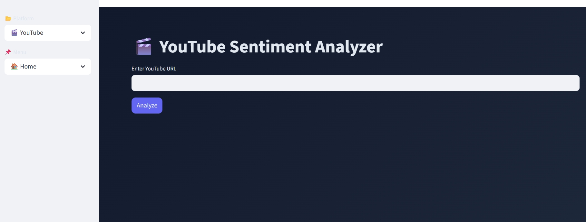
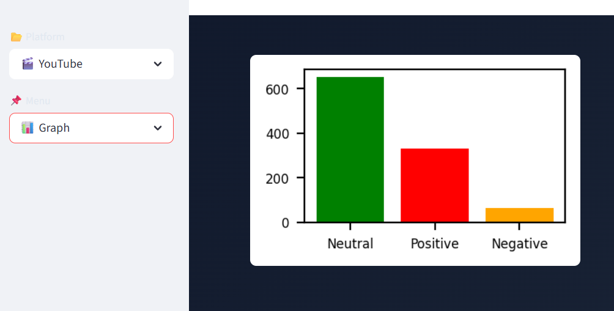
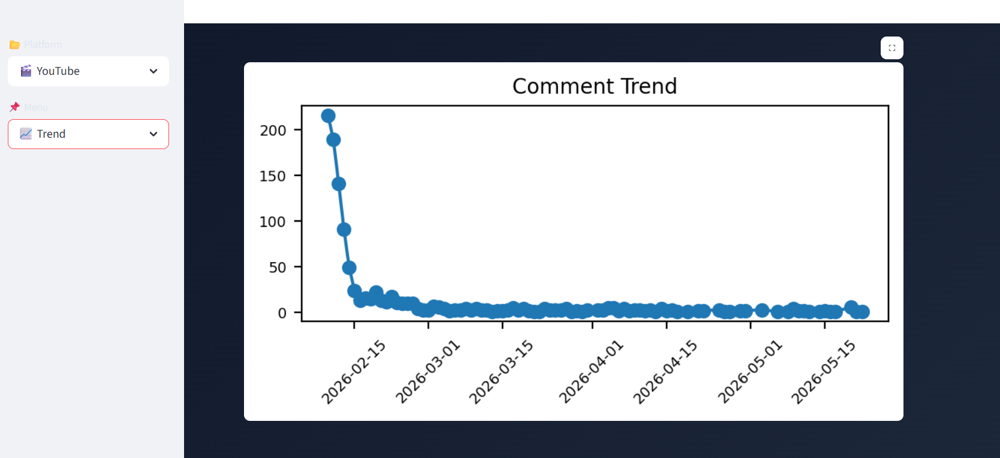
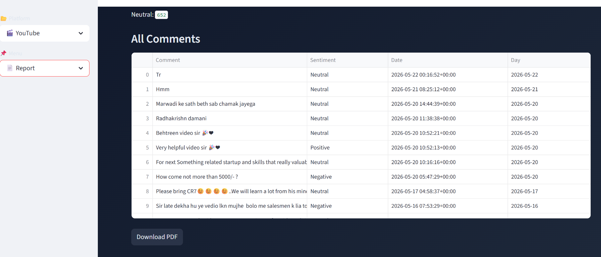

# Social Media Sentiment Analyzer

An AI-powered Social Media Sentiment Analyzer developed using **Python** and **Streamlit**.  
This project analyzes sentiments from **YouTube comments** and **X (Twitter) posts** using **Natural Language Processing (NLP)** techniques.

The application classifies comments into:

-  Positive  
-  Negative  
-  Neutral  

It also provides:
-  Sentiment Graphs
-  Trend Analysis
-  PDF Report Generation
-  Interactive Dashboard UI


#  Features
##  YouTube Sentiment Analysis
- Fetches real YouTube comments using YouTube Data API
- Performs sentiment classification
- Displays comments in separate tables:
  - Positive Comments
  - Negative Comments
  - Neutral Comments


⚠️ The X (Twitter) sentiment analysis module is currently under development.

At present, the module uses simulated/sample tweet data for demonstrating sentiment analysis functionality. Real-time tweet fetching and live API integration will be added in future updates.

### Planned Improvements
- Real-time X API integration
- Live tweet fetching
- Hashtag trend analysis
- Advanced sentiment prediction
- Better engagement analytics

This section is included for future scalability and enhancement of the project.
  

##  Sentiment Graph Visualization
- Bar graph visualization of:
  - Positive Comments
  - Negative Comments
  - Neutral Comments


##  Trend Analysis
- Day-wise comment trend visualization
- Helps understand audience engagement over time


##  PDF Report Generation
- Generates downloadable PDF reports
- Includes:
  - Sentiment summary
  - Sentiment graph
  - Full comments list


#  Sentiment Analysis Logic

This project uses the **TextBlob NLP library** for sentiment analysis.

### Polarity-Based Classification

| Polarity Score | Sentiment |
|----------------|-----------|
| > 0.1 | Positive |
| < -0.1 | Negative |
| Between -0.1 and 0.1 | Neutral |


#  Technologies Used
## Programming Language
- Python

## Libraries & Frameworks
- Streamlit
- Pandas
- TextBlob
- Matplotlib
- ReportLab
- Google API Python Client

## APIs
- YouTube Data API v3

#  Installation

## 1️ Clone Repository

```bash
git clone https://github.com/your-username/social-media-sentiment-analyzer.git
```


## 2️ Open Project Folder

```bash
cd youtube-comment-sentiment-analyzer
```


## 3️ Install Required Libraries

```bash
pip install streamlit
pip install pandas
pip install textblob
pip install matplotlib
pip install google-api-python-client
pip install reportlab
```


#  Run Project

```bash
cd C:\Users\Project (Change with your working Directory)
py -m venv venv
venv\Scripts\activate
streamlit run app.py
```


#  API Key Setup

This project requires a **YouTube Data API v3 Key**.

Replace your API key in the following line inside `app.py`:

```python
youtube = build(
    'youtube',
    'v3',
    developerKey="YOUR_YOUTUBE_API_KEY"
)
```

### Important:
- Never upload your real API key publicly on GitHub.
- Use environment variables or keep keys private for security.

# 📸 Screenshots

## 🏠 Home Page


## 📊 Graph


## 📈 Trend


## 📄 Report



#  Future Improvements

- Real-time X API Integration
- Instagram Sentiment Analysis
- AI-Based Recommendation System
- Advanced NLP Models
- Word Cloud Visualization
- Emoji Sentiment Detection


#  Educational Purpose

This project was developed for academic and learning purposes.
Author mansi kaklotar
